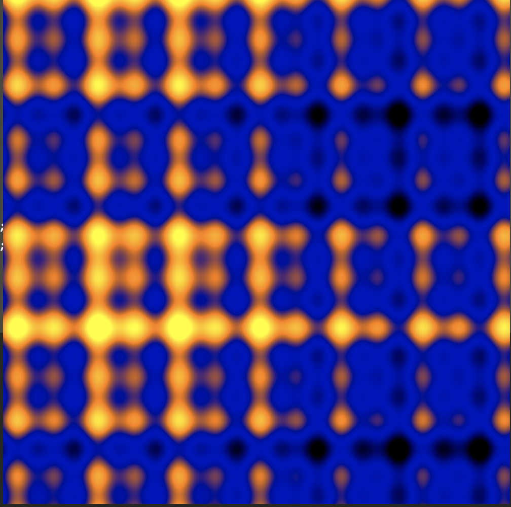
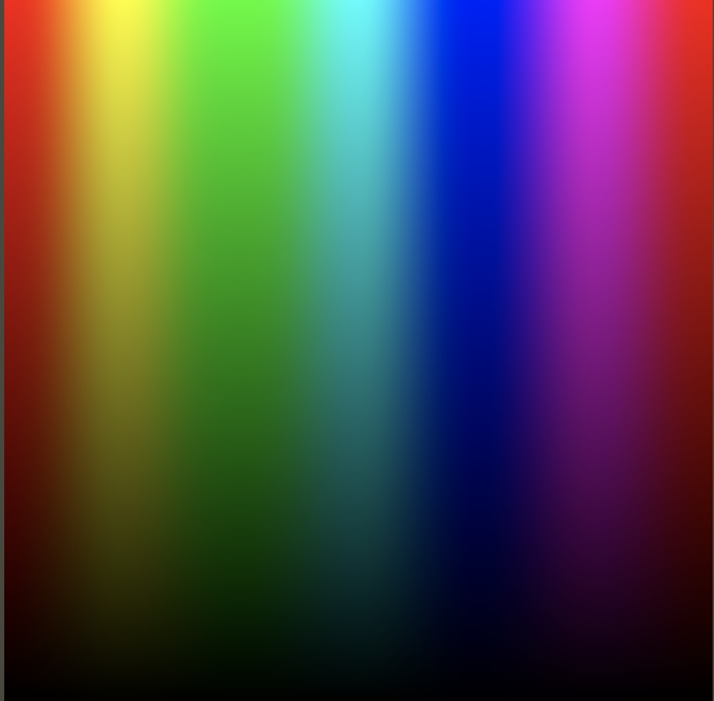
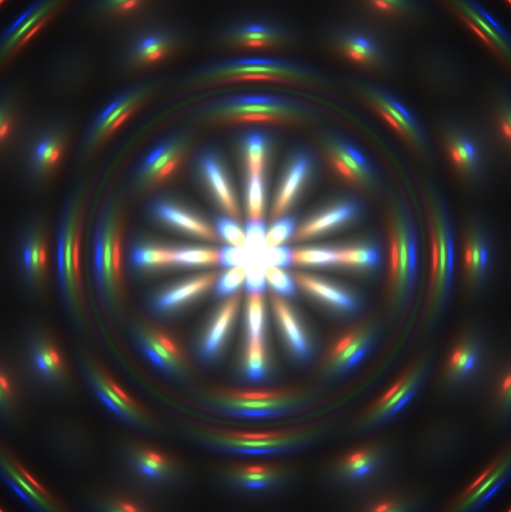

# 各种 Shaders 效果

将以下代码复制到 **[Shaders 在线编辑器](http://editor.thebookofshaders.com)** 可以查看效果。

## 效果1



```
#ifdef GL_ES
precision mediump float;
#endif

uniform vec2 u_resolution;
uniform vec2 u_mouse;
uniform float u_time;

void main() {
   vec2 position = ( gl_FragCoord.xy / u_resolution.xy ) + u_mouse / 4.0;

    float color = 0.0;
    color += sin( position.x * cos( u_time / 15.0 ) * 80.0 ) + cos( position.y * cos( u_time / 15.0 ) * 10.0 );
    color += sin( position.y * sin( u_time / 10.0 ) * 40.0 ) + cos( position.x * sin( u_time / 25.0 ) * 40.0 );
    color += sin( position.x * sin( u_time / 5.0 ) * 10.0 ) + sin( position.y * sin( u_time / 35.0 ) * 80.0 );
    color *= sin( u_time / 10.0 ) * 0.5;

    gl_FragColor = vec4( vec3( color, color * 0.5, sin( color + u_time / 3.0 ) * 0.75 ), 1.0 );
}
```

## 效果2



```
#ifdef GL_ES
precision mediump float;
#endif

#define PI 3.14159265359

uniform vec2 u_resolution;
uniform float u_time;

vec3 rgb2hsb( in vec3 c ){
    vec4 K = vec4(0.0, -1.0 / 3.0, 2.0 / 3.0, -1.0);
    vec4 p = mix(vec4(c.bg, K.wz),
                 vec4(c.gb, K.xy),
                 step(c.b, c.g));
    vec4 q = mix(vec4(p.xyw, c.r),
                 vec4(c.r, p.yzx),
                 step(p.x, c.r));
    float d = q.x - min(q.w, q.y);
    float e = 1.0e-10;
    return vec3(abs(q.z + (q.w - q.y) / (6.0 * d + e)),
                d / (q.x + e),
                q.x);
}

//  Function from Iñigo Quiles
//  https://www.shadertoy.com/view/MsS3Wc
vec3 hsb2rgb( in vec3 c ){
    vec3 rgb = clamp(abs(mod(c.x*6.0+vec3(0.0,4.0,2.0),
                             6.0)-3.0)-1.0,
                     0.0,
                     1.0 );
    rgb = rgb*rgb*(3.0-2.0*rgb);
    return c.z * mix(vec3(1.0), rgb, c.y);
}

void main(){
    vec2 st = gl_FragCoord.xy/u_resolution;
    vec3 color = vec3(0.0);

    // We map x (0.0 - 1.0) to the hue (0.0 - 1.0)
    // And the y (0.0 - 1.0) to the brightness
    color = hsb2rgb(vec3(st.x,1.0,st.y));

    gl_FragColor = vec4(color,1.0);
}
```

## 效果3



```
#ifdef GL_ES
precision mediump float;
#endif

uniform vec2 u_resolution;
uniform vec2 u_mouse;
uniform float u_time;

void main() {
    vec3 c;
    float l,z = u_time;
    for(int i = 0; i < 3; i++) {
         vec2 uv, p = gl_FragCoord.xy/u_resolution.xy;
         uv = p;
         p -= .5;
         p.x *= u_resolution.x/u_resolution.y;
         z += .07;
         l = length(p);
         uv += p/l * (sin(z)+1.) * abs(sin(l*9.-z*2.));
         c[i] = 0.018/length(abs(mod(uv,1.)-.5));
      }
      gl_FragColor = vec4(c/l,u_time);
}
```
