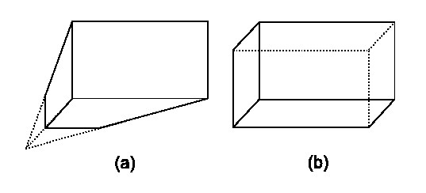

# Hellow Three.js 之 三维空间中观察物体的方法—照相机

## 照相机

此处所说照相机与现实有所差别, 由于threejs创建的场景是三维的，人眼要看出三维效果就需要有透视点。

在threejs中相机是 `THREE.Camera`，有两种类型：

- 正交投影照相机 `THREE.OrthographicCamera(left, right, top, bottom, near, far)`
- 透视投影照相机 `THREE.PerspectiveCamera(fov, aspect, near, far)`

**正交和透视的区别：**

- (a)透视投影：我们在素描中使用的透视法一致，远小近大(找一个宽阔的大马路看看远处路边的路灯及周边建筑就明白了)。
- (b)正交投影：我们在数学几何图形绘画的效果就是，三维空间内平行的线，投影到二维空间也平行

## 示例

- [正交投影示例](../demo/hello-threejs/hello-OrthographicCamera.html)
- [透视投影示例](../demo/hello-threejs/hello-PerspectiveCamera.html)

------

本文部分内容参照及引用：

> [Three.js入门指南](http://www.ituring.com.cn/book/1272)
> 
> [threejs-intro](http://davidscottlyons.com/threejs-intro/)
