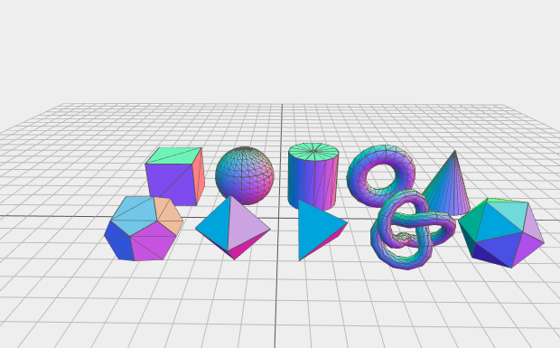

# Hellow Three.js 之 创建各种几何形状

> [Demo查看](../demo/hello-threejs/hello-geometry.html)

## 几何模型(Geometries)

几何形状（Geometry）最主要的功能是储存了一个物体的顶点信息。WebGL需要程序员指定每个顶点的位置，而在Three.js中，可以通过指定一些特征来创建几何形状，例如使用半径创建一个球体，从而省去程序员一个个指定顶点的工作量。

基本几何形状包括：立方体、平面、球体、圆柱体、四面体、八面体等几何形状，以及以三维文字作为几何形状的方法。

### 1、BoxGeometry 盒状几何体

盒型几何是四边形的原始几何类。它通常用于创建一个立方体或带有“宽度”、“高度”和“深度”构造函数参数的不规则四边形。

`BoxGeometry(width : Float, height : Float, depth : Float, widthSegments : Integer, heightSegments : Integer, depthSegments : Integer)`

- width — X轴上的面的宽度
- height — Y轴上的面的高度
- depth — Z轴上的面的深度
- widthSegments — 可选参数. 沿宽度面的分割面数量. 默认值为1.
- heightSegments — 可选参数. 沿高度面的分割面数量. 默认值为1.
- depthSegments — 可选参数. 沿深度面的分割面数量. 默认值为1.

### 2、CircleGeometry 圆形几何体

` CircleGeometry(radius, segments, thetaStart, thetaLength)`

- radius — 圆的半径, 默认值 = 50.
- segments — 分割面数量 (三角形), 最低值 = 3, 默认值 = 8.
- thetaStart — 第一个分割面的开始角度, 默认值 = 0 (3点钟方向).
- thetaLength — 圆形扇形的圆心角通常称为θ。默认为2 * Pi，这形成了一个完整的圆

### 3、ConeGeometry 圆锥形几何体

`ConeGeometry(radius, height, radialSegments, heightSegments, openEnded, thetaStart, thetaLength)`

- radius — 锥底半径. 默认值为20.
- height — 锥体高度. 默认值为100.
- radiusSegments — 围绕圆锥周长的分割面数量. 默认值为8.
- heightSegments — 沿圆锥高度的分割面数量. 默认值为1.
- openEnded — 指示锥底是打开还是覆盖的布尔值. 默认值为false, 意思是覆盖.
- thetaStart — 第一个分割面的开始角度, 默认值 = 0 (3点钟方向).
- thetaLength — 圆形扇形的圆心角通常称为θ。默认为2 * Pi，这形成了一个完整的锥体.

### 4、CylinderGeometry 圆筒几何体

`CylinderGeometry(radiusTop, radiusBottom, height, radiusSegments, heightSegments, openEnded, thetaStart, thetaLength)`

- radiusTop — 圆柱体顶端半径. 默认值为20.
- radiusBottom — 圆柱体底端半径. 默认值为20.
- height — 圆柱体高度. 默认值为100.
- radiusSegments — 围绕圆柱体周长的分割面数量. 默认值为8.
- heightSegments — 沿圆柱体高度的分割面数量. 默认值为1.
- openEnded — 指示圆柱体两端是打开还是覆盖的布尔值. 默认值为false, 意思是覆盖.
- thetaStart — 第一个分割面的开始角度, 默认值 = 0 (3点钟方向).
- thetaLength — 圆形扇形的圆心角通常称为θ。默认为2 * Pi，这形成了一个完整的圆柱体.

### 5、PlaneGeometry 平面几何体

`PlaneGeometry(width, height, widthSegments, heightSegments)`

- width — 沿X轴宽度.
- height — 沿Y轴高度
- widthSegments — 可选参数，x方向的分段数，缺省为1。
- heightSegments — 可选参数，y方向的分段数，缺省为1。

### 6、SphereGeometry 球形几何体

`SphereGeometry(radius, widthSegments, heightSegments, phiStart, phiLength, thetaStart, thetaLength)`

- radius — 球体半径. 默认值为50.
- widthSegments — 水平分割面的数量. 最小值为3, 默认值为8.
- heightSegments — 垂直分割面的数量. 最小值为2, 默认值为6.
- phiStart — 指定水平起始角度. 默认值为0.
- phiLength — 指定水平扫描角度大小. 默认值为 Math.PI * 2.
- thetaStart — 指定垂直起始角度. 默认值为0.
- thetaLength — 指定垂直扫描角度大小. 默认值为Math.PI.

### 7、TorusGeometry 空心环几何体

`TorusGeometry(radius, tube, radialSegments, tubularSegments, arc)`

- radius — 半径, 默认值为100.
- tube — 管道直径. 默认值为40.
- radialSegments — 默认值为8
- tubularSegments — 默认值为6.
- arc — 圆心角. 默认值为Math.PI * 2.

### 8、TorusKnotGeometry 环面扭结几何体

`TorusKnotGeometry(radius, tube, tubularSegments, radialSegments, p, q)`

- radius — 半径, 默认值为100.
- tube — 管道直径. 默认值为40.
- tubularSegments — 默认值为64.
- radialSegments — 默认值为8.
- p — 这个值决定了几何体绕旋转对称轴绕了多少圈. 默认值为2.
- q — 这个值决定了几何体绕环面的圆绕了多少圈. 默认值为3.

### 9、TextGeometry 3D文字几何体

`TextGeometry(text, parameters)`

text — 要显示的文字

parameters — 包含下面这些参数的对象

- font — THREE. 字体.
- size — Float. 大小.
- height — Float. 文字厚度. 默认值为50.
- curveSegments — Integer. 曲线上点的数量. 默认值为12.
- bevelEnabled — Boolean. 是否打开斜面. 默认值为False.
- bevelThickness — Float. 文本斜面的深度. 默认值为10.
- bevelSize — Float. 斜面离轮廓的距离. 默认值为8.

threejs 只提供了一部分3D字体模型. 汉字没戏了，

目前支持的字体有 helvetiker , optimer , gentilis , droid sans , droid serif 每种都包含normal正常体和 bold 粗体.

------

本文部分内容参照及引用：

> [Three.js入门指南](http://www.ituring.com.cn/book/1272)
