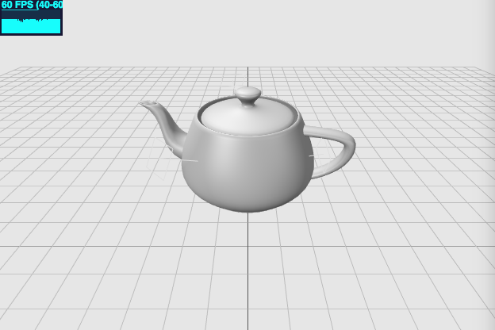
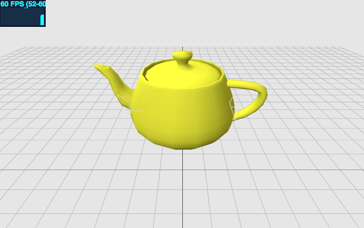
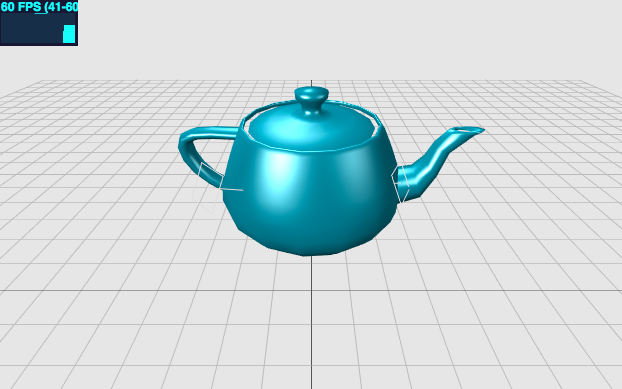

# Hellow Three.js 之 加载外部3D模型

> [Demo查看](http://codeffe.com/demo/hello-threejs/hello-loader.html)



## 外部模型

在Three.js中，创建常见几何体比较方便，但是对于复杂模型，比如人、各种动物、植物甚至现实中复杂物体。就比较麻烦，这些复杂建模通常由3D Max等工具制作好三维模型。

## 支持的格式类型

`*.obj` 是最常用的模型格式， 导入带 `*.mtl` 材质的`*.obj` 文件需要 `MTLLoader.js` 以及 `OBJMTLLoader.js`。 另有 `PLYLoader.js`、`STLLoader.js` 等分别对应不同格式的加载器，可以根据模型格式自行选择。

目前，支持的模型格式有：

- `*.obj` -- 需要 `OBJLoader.js`；
- `*.obj`, `*.mtl` -- 需要 `MTLLoader.js` 以及 `OBJMTLLoader.js`
- `*.dae`
- `*.ctm`
- `*.ply` -- 需要 `PLYLoader.js`
- `*.stl` -- 需要 `STLLoader.js`
- `*.wrl`
- `*.vtk` - 需要 `VTKLoader.js`

## 模型导入方法

创建 `loader` 变量，用于导入模型

```
var objloader = new THREE.ObjectLoader(); // 导入json格式
var OBJloader = new THREE.OBJLoader(); // 可导入 .obj格式

…… 其他格式类似
```

`loader` 导入模型的时候，接受两个参数:

- 第一个表示模型路径
- 第二个表示完成导入后的回调函数 - 一般我们需要在这个回调函数中将导入的模型添加到场景中。

### 无材质的模型

**json 格式文件加载**


```
var objloader = new THREE.ObjectLoader();
objloader.load( "./demo/models/teapot.json", function( group ) {
    mesh = group.children[0];
    mesh.material = material;
    mesh.scale.set(4,4,4);
    mesh.position.y = -30;
    scene.add( mesh );
});
```

**.obj 格式文件加载**



```
var loader = new THREE.OBJLoader();
loader.load('./demo/models/teapot.obj', function(obj) {
    obj.traverse(function(child) {
        if (child instanceof THREE.Mesh) {
            child.material = new THREE.MeshLambertMaterial({
                color: 0xffff00,
                side: THREE.DoubleSide
            });
        }
    });
    mesh = obj;
    mesh.position.y = -30;
    mesh.scale.set(30,30,30);
    scene.add(obj);
});
```

### 有材质的模型

`.mtl` 为材质文件



```
var mtlLoader = new THREE.MTLLoader();
mtlLoader.load('./demo/models/teapot.mtl', function(materials) {
    materials.preload();
    // model loader
    var objLoader = new THREE.OBJLoader();
    objLoader.setMaterials(materials);
    objLoader.load('./demo/models/teapot.obj', function (obj) {
        if (obj.children.length > 0) {
          mesh = obj;
          mesh.position.y = -30;
          mesh.scale.set(30,30,30);
          scene.add(obj);
        }
    });
});
```

--------------------------------------------------------------------------------

本文部分内容参照及引用：

> [Three.js入门指南](http://www.ituring.com.cn/book/1272)
