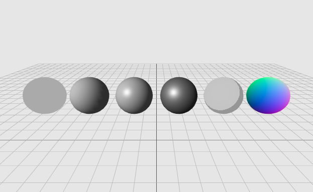
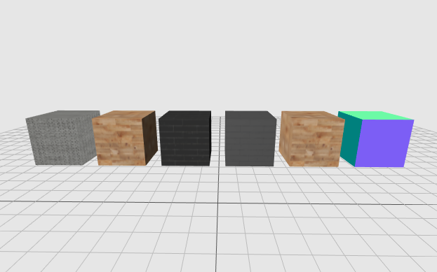

# Hellow Three.js 之 给创建的物体赋予材质

> [Demo查看](../demo/hello-threejs/hello-material.html)

## Materials 材质

**材质种类：**

- LineBasicMaterial 基础线条材质 — 可以用于THREE.Line几何体，从而创建着色的直线
- LineDashedMaterial 虚线材质 — 类似与基础材质，但可以创建虚线效果
- MeshBasicMaterial 基础网孔材质 - 为几何体赋予一种简单的颜色，或者显示几何体的线框
- MeshDepthMaterial 深度网孔材质 - 根据网格到相机的距离，该材质决定如何给网格染色
- MeshLambertMaterial 兰伯特网孔材质 - 考虑光照的影响，可以创建颜色暗淡，不光亮的物体
- MeshNormalMaterial 法向量网孔材质 - 根据物体表面的法向量计算颜色
- MeshPhongMaterial Phong网孔材质 - 考虑光照的影响，可以创建光亮的物体
- MeshPhysicalMaterial 物理材质
- MeshStandardMaterial 基础网孔材质
- MeshToonMaterial
- PointsMaterial 点材料
- RawShaderMaterial 原始着色器材料
- ShaderMaterial 着色器材料 - 使用自定义的着色器程序，直接控制顶点的放置方式，以及像素的着色方式。
- ShadowMaterial
- SpriteMaterial 精灵材料

## BasicMaterial 基本材质

使用基本材质（BasicMaterial）的物体，渲染后物体的颜色始终为该材质的颜色，而不会由于光照产生明暗、阴影效果。如果没有指定材质的颜色，则颜色是随机的。(顶图左1)

`MeshBasicMaterial( parameters : Object )`

`parameters` 为对象，默认缺省，包含各属性，常见属性：

- `visible` ：是否可见，默认为true
- `side` ：渲染面片正面或是反面，默认为正面 `THREE.FrontSide`，可设置为反面 `THREE.BackSide`，或双面 `THREE.DoubleSide`
- `wireframe` ：是否渲染线而非面，默认为 `false`
- `color` ：十六进制RGB颜色，如红色表示为 `0xff0000`
- `map` ：使用纹理贴图

## 材质的纹理贴图

纹理在threejs就好比皮肤，可以是各种图片贴图。

对于我们来说就是加载纹理图片，然后平铺到物体到某个面或者全部。

`Texture( image, mapping, wrapS, wrapT, magFilter, minFilter, format, type, anisotropy, encoding )`

- Image：这是一个图片类型，基本上它有ImageUtils来加载，如下代码
  `var image = THREE.ImageUtils.loadTexture(url);` url 是一个图片地址, 这不地址必须是 `http://xxx/imgName.jpg` 这样的。
- Mapping：是一个THREE.UVMapping()类型，它表示的是纹理坐标。
- wrapS：表示x轴的纹理的方式，
- wrapT：表示y轴的纹理回环方式。
- format：表示加载的图片的格式，这个参数可以取值THREE.RGBAFormat，RGBFormat等。THREE.RGBAFormat表示每个像素点要使用四个分量表示，分别是红、绿、蓝、透明来表示。RGBFormat则不使用透明，也就是说纹理不会有透明的效果。
- type：表示存储纹理的内存的每一个字节的格式，是有符号，还是没有符号，是整形，还是浮点型。不过这里默认是无符号型（THREE.UnsignedByteType）。
- anisotropy：各向异性过滤。使用各向异性过滤能够使纹理的效果更好，但是会消耗更多的内存、CPU、GPU时间。

------

本文部分内容参照及引用：

> [Three.js入门指南](http://www.ituring.com.cn/book/1272)
