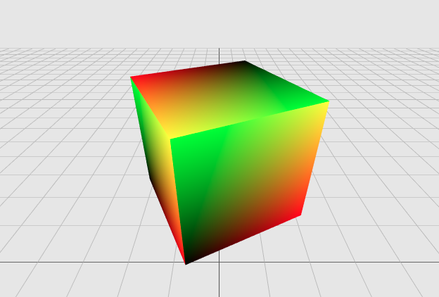

# Hellow Three.js 之 有趣的着色器

> [Demo查看](http://codeffe.com/demo/hello-threejs/hello-shader-pro.html)


## 着色器

WebGL没有固定的渲染管线，你无法直接使用一个黑盒子式的着色器；WebGL提供的是可编程的管线，这种方式更强大但也更难理解和使用。长话短说，可编程渲染管线意味着编写程序的人要自己负责获取顶点并将它绘制在屏幕上了。着色器是渲染管线的一部分，有两种着色器：

- 顶点着色器（Vertex Shader）- 它接收 attributes，计算和操作每个顶点的位置，并传递额外的数据（varyings）给片段着色器。
- 片元着色器（Fragment Shader）- 它设置绘制到屏幕上的每个单独的片段（像素）颜色。

这两种着色器都完全运行在显卡的GPU上。

### 顶点着色器

顶点着色器中的"顶点"指的正是 `Mesh` 中的顶点，对于每个顶点调用一次。因此，如果场景中有一个正方体，那么对八个顶点将各自调用一次顶点着色器，可以修改顶点的位置或者颜色等信息，然后传入片元着色器。

### 片元着色器

片元是栅格化之后，在形成像素之前的数据。片元着色器是每个片元会调用一次的程序，因此，片元着色器特别适合用来做图像后处理。

### 着色器变量

- uniforms - 既可以传入顶点着色器，也可以传入片元着色器, 它们包含了哪些在整个渲染过程中保持不变的变量，比如灯光，雾。
- attributes - 与每个顶点关联的变量，例如，顶点位置，法线和顶点颜色都是存储在attributes中的数据。attributes只可以在顶点着色器重访问。
- varyings - 是从顶点着色器传递到片段着色器的变量。对于每一个片段，每一个varying的值将是相邻顶点值的平滑插值。

## 着色器编程



### 顶点着色器

着色器是一段在GPU中执行的接近C语言的代码，顶点着色器对于每个顶点调用一次，片元着色器对于每个片元调用一次。、

```
// 声明了一个叫vUv的变量，它的类型为vec2 顶点着色器和片元着色器都包含了该变量
varying vec2 vUv;
void main() {
    // 将 vUv 设置为 uv ，后者是 Three.js 创建并传递给着色器的 attribute 变量    
    vUv = uv;  // uv 它代表了该顶点在UV映射时的横纵坐标
    gl_Position = projectionMatrix * modelViewMatrix * vec4(position, 1.0);
}
```

如上代码：

- 从 `main()` 函数开始
- `gl_Position` 全局变量
- `vec2` 二分量浮点向量
- `vec4` 四分量浮点向量，四个变元分别响应红，绿，蓝和透明度通道

GLSL 类型 | JavaScript 类型 | 尺寸
:------ | ------------: | -:
float   |        Number |  1
vec2    | THREE.Vector2 |  2
vec3    | THREE.Vector3 |  3
vec3    |   THREE.Color |  3
vec4    | THREE.Vector4 |  4

`varing` 是 WebGL定义限定符（Qualifier）用于数据类型（Type）之前，表明该变量的性质。

限定符共有四个：

- const：这是我们熟悉的常量的意思
- attribute：从JavaScript代码传递到顶点着色器中，每个顶点对应不同的值
- uniform：每个顶点/片元对应相同的值
- varying：从顶点着色器传递到片元着色器中

### 片元着色器

有了前面顶点着色器传过来的vUv信息，我们能做些有意思的事了吧？比如来看看使用颜色表示uv信息如何？

```
uniform float u_time; // 时间（加载后的秒数）
varying vec2 vUv; // 和顶点着色器中一样的变量 vUv
void main() {
    // 用 u_time 加上一个 sin 函数，来展示图中蓝色的动态变化。
    gl_FragColor = vec4(vUv.x, vUv.y, abs(sin(u_time)), 1.0);
}
```

实际操作中的 uniform 。在上面的代码中我们使用 u_time 加上一个 sin 函数，来展示图中蓝色的动态变化。

GLSL 还有更多惊喜。GPU 的硬件加速支持我们使用角度，三角函数和指数函数。这里有一些这些函数的介绍：`sin()`, `cos()`, `tan()`, `asin()`, `acos()`, `atan()`, `pow()`, `exp()`, `log()`, `sqrt()`, `abs()`, `sign()`, `floor()`, `ceil()`, `fract()`, `mod()`, `min()`, `max()` 和 `clamp()`。

事实上，我们可以分别测试R、G、B三个通道，分别设置不同的速率等，看看有什么有趣等效果。

#### Uniforms 统一值

这些输入值叫做 uniform （统一值），它们的数据类型通常为：float, vec2, vec3, vec4, mat2, mat3, mat4, sampler2D and samplerCube。uniform 值需要数值类型前后一致。且在 shader 的开头，在设定精度之后，就对其进行定义。

推荐命名方式：按业界传统应在 uniform 值的名字前加 u_ ，这样一看即知是 uniform

```
uniform vec2 u_resolution; // 画布尺寸（宽，高）
uniform vec2 u_mouse;      // 鼠标位置（在屏幕上哪个像素）
uniform float u_time;     // 时间（加载后的秒数）
```

这里查看 [demo](http://codeffe.com/demo/hello-threejs/hello-shader-1.html)

最后可能也是最重要的细节是，GLSL 语言规范并不保证变量会被自动转换类别。这句话是什么意思呢？显卡的硬件制造商各有不同的显卡加速方式，但是却被要求有最精简的语言规范。因而，自动强制类型转换并没有包括在其中。在我们的"hello world!"例子中，vec4 精确到单精度浮点，所以应被赋予 float 格式，最好养成在 float 型数值里加一个 .0 的好习惯。比如 `1` 要写成 `1.0`, 同样 `0` 也要写成 `0.0`。

--------------------------------------------------------------------------------

本文部分内容参照及引用：

> [着色器-上](http://www.cnblogs.com/yiyezhai/archive/2013/01/21/2864358.html)-原文-[An Introduction to Shaders - Part 1](https://aerotwist.com/tutorials/an-introduction-to-shaders-part-1/)

> [着色器-下](http://www.cnblogs.com/yiyezhai/archive/2013/01/22/2865249.html)-原文-[An Introduction to Shaders - Part 2](https://aerotwist.com/tutorials/an-introduction-to-shaders-part-2/)

> [Three.js入门指南](http://www.ituring.com.cn/book/1272)

> [Thebookofshaders](https://thebookofshaders.com/01/?lan=ch)

> [如何从shaderToy上扒代码](https://zhuanlan.zhihu.com/p/34044609)
