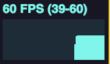
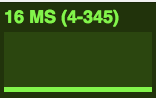

# Hellow Three.js 之 运动物体的性能监测

> [Demo查看](http://codeffe.com/demo/hello-threejs/hello-stats.html)

## 基础知识

关于性能：测试一个程序，性能上是否有瓶颈，在动画里，经常使用帧数的概念，首先我们来定义一下帧数的意义。

> 帧数：图形处理器每秒钟能够刷新几次，通常用fps（Frames Per Second）来表示。

当物体在快速运动时,当人眼所看到的影像消失后，人眼仍能继续保留其影像1/24秒左右的图像，这种现象被称为视觉暂留现象。是人眼具有的一种性质。人眼观看物体时，成像于视网膜上，并由视神经输入人脑，感觉到物体的像。一帧一帧的图像进入人脑，人脑就会将这些图像给连接起来，形成动画。

毫无疑问，帧数越高，画面的感觉就会越好。所以大多数游戏都会有超过30的FPS。为了监视FPS，看看你的程序哪里占用了很多的CPU时间，就需要学习一下性能监视器。

## 性能监视器Stats

在Three.js中，性能由一个[性能监视器](https://github.com/mrdoob/stats.js)来管理。

性能监视器的截图如下所示:

 

- FPS表示：上一秒的帧数，这个值越大越好，一般都为60左右。点击此视图，就会变成下面的另一个视图。
- MS表示：渲染一帧需要的毫秒数，这个数字是越小越好。再次点击又可以回到FPS视图中。

## Stats 使用方法

添加性能测试窗体

```
var stats = new Stats();
stats.setMode(1); // 0: fps, 1: ms
stats.domElement.style.position = 'absolute';
document.body.appendChild( stats.domElement );
```

调用stats.update()函数来统计时间和帧数 `stats.update();` 到 `renderer` 执行动画到时候即可。

--------------------------------------------------------------------------------

本文部分内容参照及引用：

> [Three.js入门指南](http://www.ituring.com.cn/book/1272)
