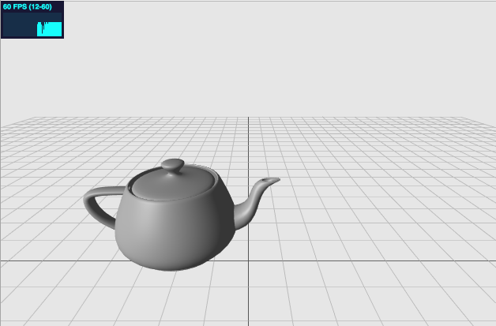
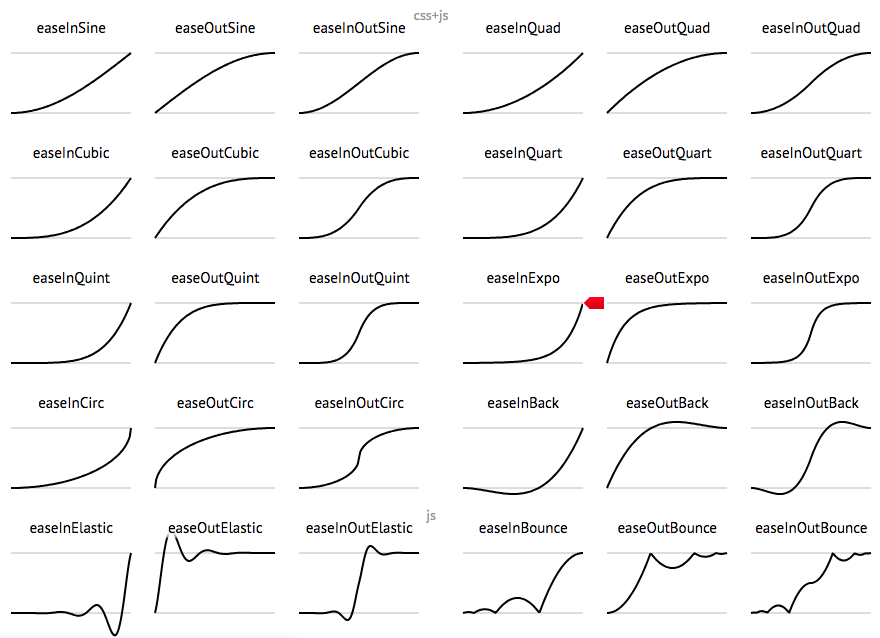

# Hellow Three.js 之 让物体动起来

> [Demo查看](../demo/hello-threejs/hello-tween.html)



## 动画原理

在这里，我们将动态画面简称为动画（animation）。正如动画片的原理一样，动画的本质是利用了人眼的视觉暂留特性，快速地变换画面，从而产生物体在运动的假象。而对于Three.js程序而言，动画的实现也是通过在每秒中多次重绘画面实现的。

为了衡量画面切换速度，引入了每秒帧数FPS（Frames Per Second）的概念，是指每秒画面重绘的次数。FPS越大，则动画效果越平滑，当FPS小于20时，一般就能明显感受到画面的卡滞现象。

那么FPS是不是越大越好呢？其实也未必。当FPS足够大（比如达到60），再增加帧数人眼也不会感受到明显的变化，反而相应地就要消耗更多资源（比如电影的胶片就需要更长了，或是电脑刷新画面需要消耗计算资源等等）。因此，选择一个适中的FPS即可。

NTSC标准的电视FPS是30，PAL标准的电视FPS是25，电影的FPS标准为24。而对于Three.js动画而言，一般FPS在30到60之间都是可取的。

## 动画的实现方法

### [requestAnimationFrame](https://developer.mozilla.org/zh-CN/docs/Web/API/Window/requestAnimationFrame)方法

`window.requestAnimationFrame(callback);`

`requestAnimationFrame` 方法告诉浏览器您希望执行动画并请求浏览器在下一次重绘之前调用指定的函数来更新动画，通常可能达到60FPS。

在之前demo中我们已经有过使用的代码，立方体的旋转等。

```
// 循环动画
function animate() {
  mesh.rotation.x += 0.01;
  mesh.rotation.y += 0.02;
  requestAnimationFrame(animate);
  renderer.render(scene, camera);
}
```

### [Tweenjs](https://github.com/tweenjs/tween.js) 实现

Tween.js是一个包含各种经典动画算法的JS资源,动画效果主要包括以下：

Quad, Cubic等等都是经典的动画运动算法名称，完整列表如下：

* Linear：线性匀速运动效果；
* Quadratic：二次方的缓动（t^2）；
* Cubic：三次方的缓动（t^3）；
* Quartic：四次方的缓动（t^4）；
* Quintic：五次方的缓动（t^5）；
* Sinusoidal：正弦曲线的缓动（sin(t)）；
* Exponential：指数曲线的缓动（2^t）；
* Circular：圆形曲线的缓动（sqrt(1-t^2)）；
* Elastic：指数衰减的正弦曲线缓动；
* Back：超过范围的三次方缓动 `（(s+1)*t^3 – s*t^2）`
* Bounce：指数衰减的反弹缓动

每个效果都分三个缓动方式，分别是：

* easeIn：从0开始加速的缓动，也就是先慢后快；
* easeOut：减速到0的缓动，也就是先快后慢；
* easeInOut：前半段从0开始加速，后半段减速到0的缓动。

这里还有一份 [缓动函数速查表](https://easings.net/zh-cn#)




***Tween.js 具体用法***

tween.js 可以链式调用！ 每个tween函数都会返回tween实例。

让某物体从A位置移动到B位置，

```
var position = { x: 100, y: 0 }
var tween = new TWEEN.Tween(position)
	.to({ x: 200 }, 1000)
	.start();
```


------

本文部分内容参照及引用：

> [tween是什么？如何使用？](https://github.com/tweenjs/tween.js/blob/master/docs/user_guide_zh-CN.md)
>
> [Three.js入门指南](http://www.ituring.com.cn/book/1272)
>
> [详解requestAnimationFrame](https://www.zhangxinxu.com/wordpress/2013/09/css3-animation-requestanimationframe-tween-动画算法/)
